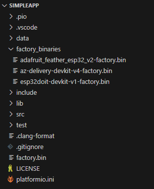
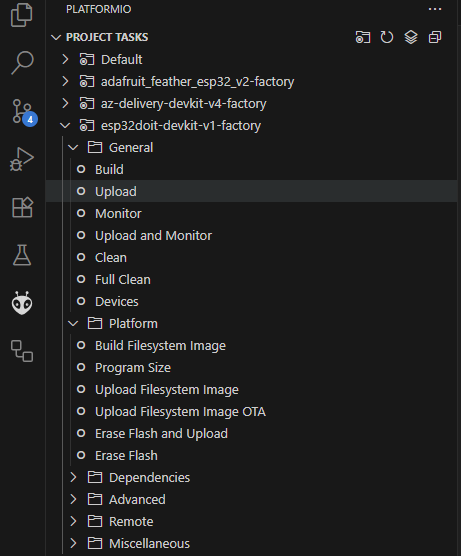
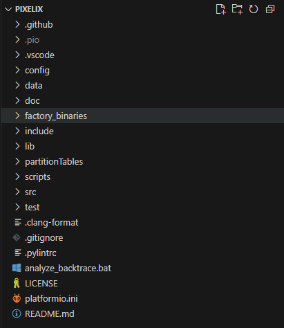

# PixelixUpdater <!-- omit in toc -->

[](http://choosealicense.com/licenses/mit/)
[](https://www.repostatus.org/#wip)
[](https://github.com/BlueAndi/PixelixUpdater/releases)
[](https://github.com/BlueAndi/PixelixUpdater/actions/workflows/main.yml)

The Pixelix updater application is flashed to a factory partition and provides the update possibility for Pixelix.

## Table of Content <!-- omit in toc -->

- [Motivation](#motivation)
- [How It Works](#how-it-works)
- [PixelixUpdater webinterface](#pixelixupdater-webinterface)
- [Simple App](#simple-app)
- [How To Get Started](#how-to-get-started)
- [How To Integrate Into Pixelix](#how-to-integrate-into-pixelix)
- [How To Update The PixelixUpdater](#how-to-update-the-pixelixupdater)
- [Used Libraries](#used-libraries)
- [Issues, Ideas And Bugs](#issues-ideas-and-bugs)
- [License](#license)
- [Contribution](#contribution)

## Motivation

Pixelix grew over time with more and more features. Even more as fit into a a 4 MB flash development board. Initially, some features were disabled to save space. But meanwhile with Arduino 3.x the amount of required flash space with OTA support wasn't enough anymore.
The idea was raised to use only one application partition along with a small factory partition, unlike the standard OTA configuration defined by Espressif, which uses two application partitions ([https://docs.espressif.com/projects/esp-idf/en/latest/esp32/api-guides/partition-tables.html](https://docs.espressif.com/projects/esp-idf/en/latest/esp32/api-guides/partition-tables.html)). This way the application partition size increases and gives the possibility to continue with Arduino 3.x and to support more features again.

## How It Works

Pixelix is flashed to the app partition and the PixelixUpdater is flashed to the factory partition. Under normal circumstances the app partition is active. A OTA update can be requested by the user through the Pixelix Web interface. This will result in a reboot from the factory partition into PixelixUpdater. After a few seconds the website will reload and change to the webinterface of the PixelixUpdater. This is where the user can upload their firmware or filesystem binaries. If the upload finishes successfully a notification will be shown. To get back to Pixelix the user needs to press the **Back to Pixelix** button.


## PixelixUpdater webinterface

The webinterface of the PixelixUpdater offers two file browser fields for uploading the Pixelix firmaware bin file and/or the file system image. Before uploading the firmware binary, make sure it is compatible with your board.


## Simple App

The update process is demonstrated using the SimpleApp example code from this repository. Instead of Pixelix the SimpleApp runs in the app partition and spawns a minimalistic webinterface.


## How To Get Started

To install the necessary toolchain you can follow the installation guide from Pixelix until you reach "Next Step": [https://github.com/BlueAndi/Pixelix/blob/master/doc/config/TOOLCHAIN-INSTALLATION.md](https://github.com/BlueAndi/Pixelix/blob/master/doc/config/TOOLCHAIN-INSTALLATION.md). If you've reached "Next Step" click on the link below. Instead of cloning the Pixelix repository you can use

```bash
git clone https://github.com/BlueAndi/PixelixUpdater.git
```

to clone the repository of the PixelixUpdater.
Now open the cloned repository folder in VSCode. Continue following the guide to build the PixelixUpdater binary.
If you want to test the OTA update process using the SimpleApp, open the `example/SimpleApp` folder in VSCode.
First, make sure that the `factory_binaries` folder contains a binary that matches your board.



Each release of the PixelixUpdater includes a ZIP file as an asset, which contains the PixelixUpdater binaries for all supported boards. Download this ZIP file and copy the binaries into the `factory_binaries` folder.
To upload both the SimpleApp and PixelixUpdater binaries press the **Upload** button matching your board in the PlatformIO toolbar (to access the toolbar, click on the ant head icon in the left sidebar).
After booting your board will spawn an Access Point. The password for the Access Point will be: Luke, I am your father.



## How To Integrate Into Pixelix

Just like the SimpleApp, Pixelix includes a `factory_binaries` folder.



Each release of the Pixelix Updater includes a ZIP file as an asset, which contains the PixelixUpdater binaries for all supported boards. Download this ZIP file and copy the binaries into the `factory_binaries` folder of Pixelix.
To update the PixelixUpdater press the **Upload** button as shown above. This will upload the PixelixUpdater together with the Pixelix firmware. After both have been uploaded together, the board performs its first boot from the application partition. This is, for example, the case after erasing the flash memory.

Please note: The PixelixUpdater cannot be flashed via OTA update.

## How To Update The PixelixUpdater

Take a look at "How To Integrate Into Pixelix".
Simply replace the existing binaries in the `factory_binaries` folder with the updated ones from the latest release of the PixelixUpdater then press the **Upload** button.

## Used Libraries

| Library | Description | License |
| - | - | - |
| [Arduino](https://github.com/platformio/platform-espressif32) | ESP32 Arduino framework v2.x.x | Apache-2.0 |
| [PlatformIO](https://platformio.org) | PlatformIO is a cross-platform, cross-architecture, multiple framework, professional tool for embedded systems engineers and for software developers who write applications for embedded products. | Apache-2.0 |
| [Bootstrap](https://getbootstrap.com/) | CSS Framework | MIT |
| [POPPER JS](https://popper.js.org/) | POPPER JS | MIT |
| [jQuery](https://jquery.com/) | Javascript librariy for DOM handling | MIT |

## Issues, Ideas And Bugs

If you have further ideas or you found some bugs, great! Create a [issue](https://github.com/BlueAndi/PixelixUpdater/issues) or if you are able and willing to fix it by yourself, clone the repository and create a pull request.

## License

The whole source code is published under the [MIT license](http://choosealicense.com/licenses/mit/).
Consider the different licenses of the used third party libraries too!

## Contribution

Unless you explicitly state otherwise, any contribution intentionally submitted for inclusion in the work by you, shall be licensed as above, without any
additional terms or conditions.
