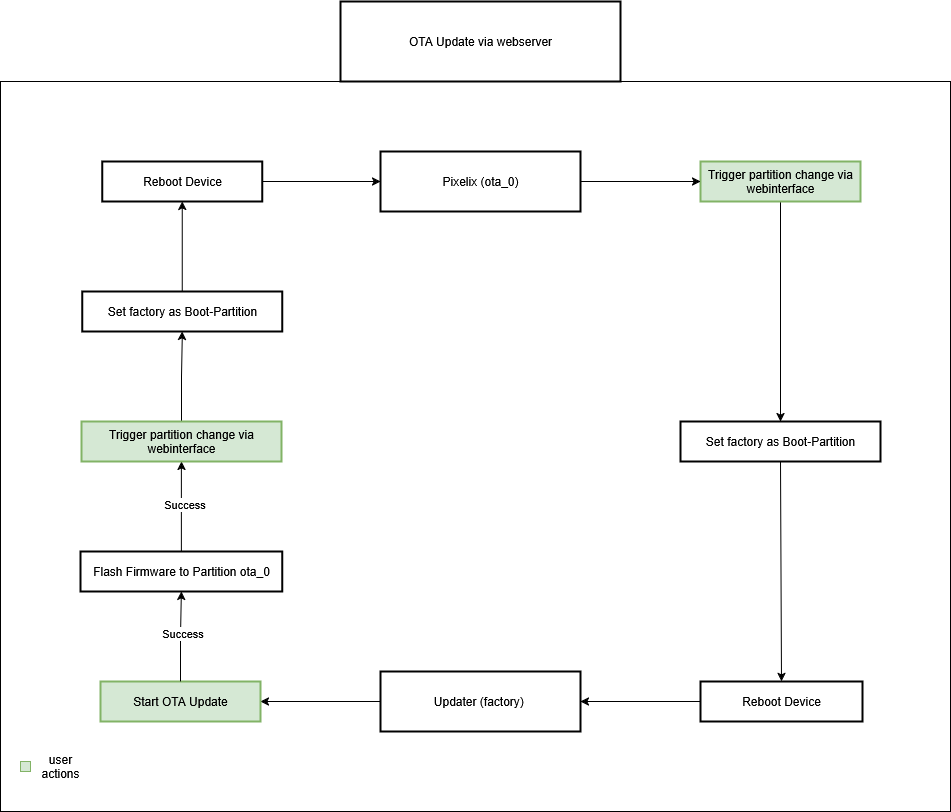
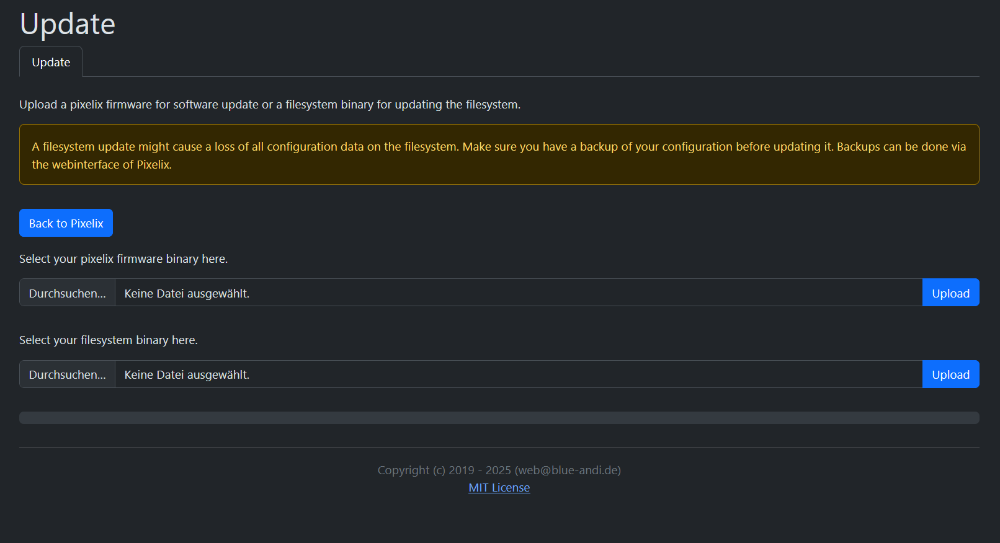
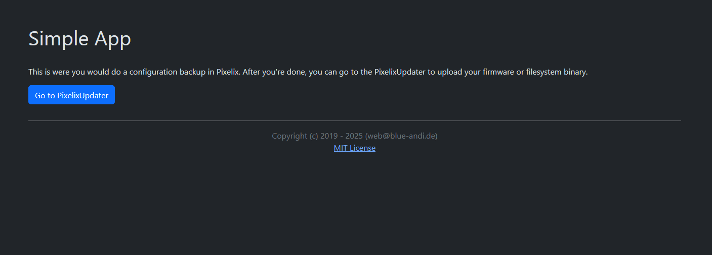

# PixelixUpdater <!-- omit in toc -->

[](http://choosealicense.com/licenses/mit/)
[](https://www.repostatus.org/#wip)
[](https://github.com/BlueAndi/PixelixUpdater/releases)
[](https://github.com/BlueAndi/PixelixUpdater/actions/workflows/main.yml)

The Pixelix updater application is flashed to a factory partition and provides the update possibility for Pixelix.

## Table of Content <!-- omit in toc -->

- [Motivation](#motivation)
- [How It Works](#how-it-works)
- [PixelixUpdater webinterface](#pixelixupdater-webinterface)
- [Example App](#example-app)
- [How To Get Started](#how-to-get-started)
- [How To Update The PixelixUpdater When A New Release Is Available](#how-to-update-the-pixelixupdater-when-a-new-release-is-available)
- [Used Libraries](#used-libraries)
- [Issues, Ideas And Bugs](#issues-ideas-and-bugs)
- [License](#license)
- [Contribution](#contribution)

## Motivation

Pixelix got over time more and more features. Even more as fit on a 4 MB flash development board. Initially, some features were disabled to save space. But meanwhile with Arduino 3.x the amount of required flash space with OTA support wasn't enough anymore.
The idea raised up to use just one application partition and a small factory partition. This way the application partition size increases and gives the possibility to continue with Arduino 3.x and to support more features again.

## How It Works

Pixelix is flashed to the app partition and the PixelixUpdater is flashed to the factory partition. Under normal circumstances the app partition is active. However, if an OTA update needs to be done the user can trigger a switch to the factory partition via the webinterface of Pixelix. The device will then reboot and start in the factory partition. After a few seconds the website will reload and change to the webinterface of the PixelixUpdater. This is where the user can upload their firmware or filesystem binaries. If the upload finishes successfully a notification will be shown. It is always possible to switch back to the app partition via the webinterface of the PixelixUpdater.



## PixelixUpdater webinterface

The webinterface of the PixelixUpdater offers 2 separate file inputs. One for the firmware binary and one for the filesystem binary. Before uploading the firmware binary, make sure it is compatible with your board.



## Example App

The upload process can be tested with the SimpleApp. Instead of Pixelix the SimpleApp runs in the app partition and spawns a minimalistic webinterface. 



## How To Get Started

Install the necessary toolchain. To do that you can follow the installation guide from Pixelix until you reach "Next Step": https://github.com/BlueAndi/Pixelix/blob/master/doc/config/TOOLCHAIN-INSTALLATION.md. If you've reached "Next Step" click on the link below. Instead of cloning the Pixelix repository you can use 
```bash
$ git clone https://github.com/BlueAndi/PixelixUpdater.git
```
to clone the repository of the PixelixUpdater. 
Now open the repository in VSCode. If you have done this successfully, you can continue following the guide to build the PixelixUpdater binary.
If you want to test the OTA update process using the SimpleApp, open the `example/SimpleApp` directory in VSCode.
First, make sure that the `factory_binaries` directory contains a binary that matches your board. This should be the case by default. 
If such a binary exists, press the **Upload** button in the PlatformIO toolbar (to access the toolbar, click on the ant head icon in the left sidebar) to upload both the SimpleApp and PixelixUpdater binaries.
If the binary is not available, you can build it yourself as described in the guide. After building the binary, copy it into the `factory_binaries` directory.

## How To Update The PixelixUpdater When A New Release Is Available

Just like the SimpleApp, Pixelix includes a `factory_binaries` directory.
To integrate a new release of PixelixUpdater into Pixelix, simply replace the existing binaries in the `factory_binaries` directory with the updated ones from the latest release.
Each release includes a ZIP file as an asset, which contains the PixelixUpdater binaries for all supported boards. If you have successfully replaced the binaries, you need to flash Pixelix by pressing the Upload button of the PlatformIO toolbar (you can access the toolbar by clicking the ant head icon in the left sidebar). This will flash both Pixelix and the PixelixUpdater together. 

Please note: the PixelixUpdater cannot be flashed via OTA update.

## Used Libraries

| Library | Description | License |
| - | - | - |
| [Arduino](https://github.com/platformio/platform-espressif32) | ESP32 Arduino framework v2.x.x | Apache-2.0 |
| [PlatformIO](https://platformio.org) | PlatformIO is a cross-platform, cross-architecture, multiple framework, professional tool for embedded systems engineers and for software developers who write applications for embedded products. | Apache-2.0 |
| [Bootstrap](https://getbootstrap.com/) | CSS Framework | MIT |
| [POPPER JS](https://popper.js.org/) | POPPER JS | MIT |
| [jQuery](https://jquery.com/) | Javascript librariy for DOM handling | MIT |

## Issues, Ideas And Bugs

If you have further ideas or you found some bugs, great! Create a [issue](https://github.com/BlueAndi/PixelixUpdater/issues) or if you are able and willing to fix it by yourself, clone the repository and create a pull request.

## License

The whole source code is published under the [MIT license](http://choosealicense.com/licenses/mit/).
Consider the different licenses of the used third party libraries too!

## Contribution

Unless you explicitly state otherwise, any contribution intentionally submitted for inclusion in the work by you, shall be licensed as above, without any
additional terms or conditions.
